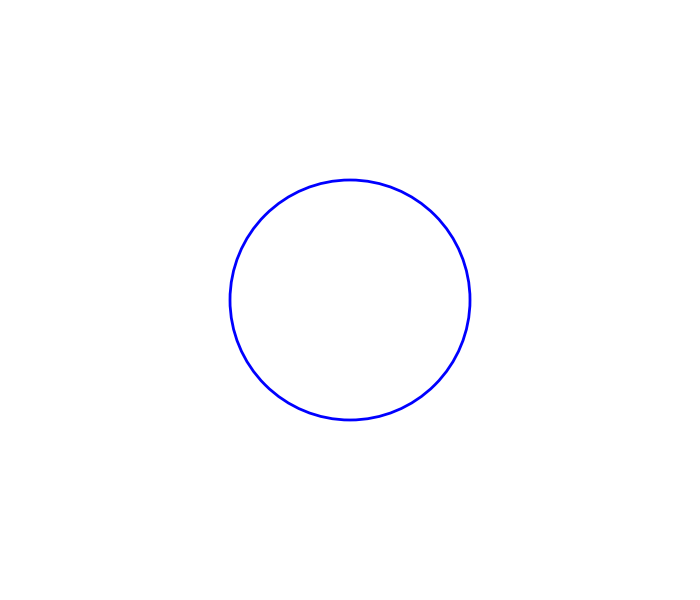
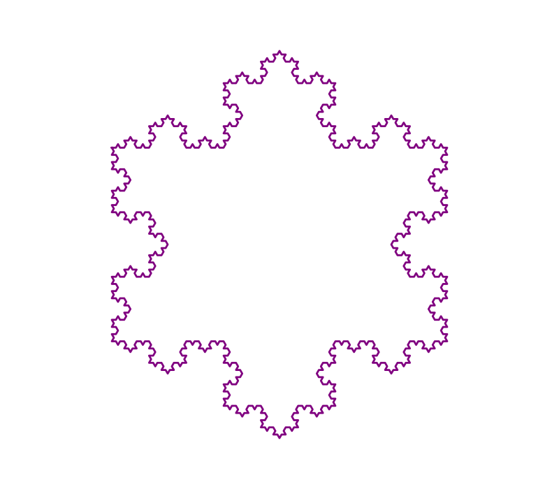

# 计算机图形学作业报告 week1

| 年级 | 姓名 | 学院 | 专业 | 学号 |
| ---- | ---- | ---- | ---- | ---- |
|   大五   | 王昊 | 数学科学学院 | 信息与计算科学 | 3220103613 |


## 算法描述与核心代码讲解
本次作业使用 Matplotlib 库进行绘制。

**circle.py**使用`matplotlib.patches.Circle`画出圆形。

**koch_curve.py**使用递归函数计算 Koch 曲线的顶点，再调用 Matplotlib 连接所有顶点。0 阶 Koch 曲线是一条直线，而 n 阶 Koch 曲线由 4 条 n-1 阶 Koch 曲线经旋转拼接组成，这恰好可以用递归函数表达。

绘制结果由 **image_utils.py** 中的`save_figure`函数保存。

## 实验结果

配置环境:

> pip install -r requirements.txt

运行程序:

> ./run.bat

实验结果如下：



## 思考与总结
- 学习了项目文件的结构。
- 学习了matplotlib库中部分函数的用法。

## 参考
1. https://chatgpt.com/

## 源文件

**image_utils.py**

```python
# 将指定图片保存至指定位置，含默认目录。

from pathlib import Path

from matplotlib.figure import Figure


DEFAULT_OUTPUT_DIRECTORY = Path(__file__).resolve().parent.parent / "docs" / "images"


def save_figure(
    figure: Figure,
    filename: str | Path,
    *,
    output_directory: str | Path = DEFAULT_OUTPUT_DIRECTORY,
) -> Path:
    
    name = Path(filename)
    if not name.name or name != Path(name.name):
        raise ValueError("filename 不能包含路径，请使用 output_directory")

    path = Path(output_directory) / name
    path.parent.mkdir(parents=True, exist_ok=True)
    figure.savefig(
        path,
        dpi=figure.dpi,
        facecolor=figure.get_facecolor(),
        edgecolor="none",
    )
    return path

```

**circle.py**

```python
"""使用 Matplotlib 绘制圆形。"""

from pathlib import Path

import matplotlib.pyplot as plt
from matplotlib.patches import Circle

from image_utils import save_figure


SCREEN_WIDTH = 700
SCREEN_HEIGHT = 600
FIGURE_DPI = 100


def draw_circle(radius: float = 120, *, show: bool = True) -> Path:
    """绘制并保存圆形，可选择是否显示 Matplotlib 窗口。"""
    if radius <= 0:
        raise ValueError("radius 必须大于 0")

    figure, axes = plt.subplots(
        figsize=(SCREEN_WIDTH / FIGURE_DPI, SCREEN_HEIGHT / FIGURE_DPI),
        dpi=FIGURE_DPI,
    )
    figure.canvas.manager.set_window_title("Circle")
    figure.subplots_adjust(left=0, right=1, bottom=0, top=1)

    axes.add_patch(
        Circle(
            (0, 0),
            radius,
            fill=False,
            edgecolor="blue",
            linewidth=2,
        )
    )
    axes.set_xlim(-SCREEN_WIDTH / 2, SCREEN_WIDTH / 2)
    axes.set_ylim(-SCREEN_HEIGHT / 2, SCREEN_HEIGHT / 2)
    axes.set_aspect("equal", adjustable="box")
    axes.axis("off")

    saved_path = save_figure(figure, "circle.png")
    print(f"Saved image: {saved_path}")

    if show:
        plt.show()
    else:
        plt.close(figure)

    return saved_path


if __name__ == "__main__":
    draw_circle()

```

**koch_curve.py**

```python
"""使用 Matplotlib 和递归算法绘制 Koch 雪花。"""

import math
from pathlib import Path

import matplotlib.pyplot as plt

from image_utils import save_figure


SCREEN_WIDTH = 800
SCREEN_HEIGHT = 700
FIGURE_DPI = 100

Point = tuple[float, float]


def _append_koch_points(
    points: list[Point],
    start: Point,
    heading: float, # 角度
    length: float,
    order: int,
) -> Point:
    """递归追加一段 Koch 曲线的顶点，并返回终点。"""
    if order == 0:
        angle = math.radians(heading)
        end = (
            start[0] + length * math.cos(angle),
            start[1] + length * math.sin(angle),
        )
        points.append(end)
        return end

    segment = length / 3
    point = start
    for turn in (0, 60, -120, 60):
        heading += turn
        point = _append_koch_points(
            points,
            point,
            heading,
            segment,
            order - 1,
        )
    return point


def koch_curve(
    length: float,
    order: int,
    *,
    start: Point = (0.0, 0.0),
    heading: float = 0.0,
) -> list[Point]:
    """计算一段 Koch 曲线的全部顶点。"""
    if length <= 0:
        raise ValueError("length 必须大于 0")
    if order < 0:
        raise ValueError("order 不能小于 0")

    points = [start]
    _append_koch_points(points, start, heading, length, order)
    return points


def koch_snowflake_points(order: int, length: float) -> list[Point]:
    """计算由三段 Koch 曲线组成的雪花顶点。"""
    if order < 0:
        raise ValueError("order 不能小于 0")
    if length <= 0:
        raise ValueError("length 必须大于 0")

    triangle_height = length * math.sqrt(3) / 2
    point = (-length / 2, triangle_height / 3)
    heading = 0.0
    points = [point]

    for _ in range(3):
        side = koch_curve(length, order, start=point, heading=heading)
        points.extend(side[1:])
        point = side[-1]
        heading -= 120

    return points


def draw_koch_snowflake(
    order: int = 4,
    length: float = 480,
    *,
    show: bool = True,
) -> Path:
    """绘制并保存 Koch 雪花，可选择是否显示 Matplotlib 窗口。"""
    points = koch_snowflake_points(order, length)
    x_coordinates, y_coordinates = zip(*points)

    figure, axes = plt.subplots(
        figsize=(SCREEN_WIDTH / FIGURE_DPI, SCREEN_HEIGHT / FIGURE_DPI),
        dpi=FIGURE_DPI,
    )
    figure.canvas.manager.set_window_title("Koch Snowflake")
    figure.subplots_adjust(left=0, right=1, bottom=0, top=1)

    axes.plot(x_coordinates, y_coordinates, color="purple", linewidth=2)
    axes.set_xlim(-SCREEN_WIDTH / 2, SCREEN_WIDTH / 2)
    axes.set_ylim(-SCREEN_HEIGHT / 2, SCREEN_HEIGHT / 2)
    axes.set_aspect("equal", adjustable="box")
    axes.axis("off")

    saved_path = save_figure(figure, "koch_curve.png")
    print(f"Saved image: {saved_path}")

    if show:
        plt.show()
    else:
        plt.close(figure)

    return saved_path


if __name__ == "__main__":
    draw_koch_snowflake()

```

