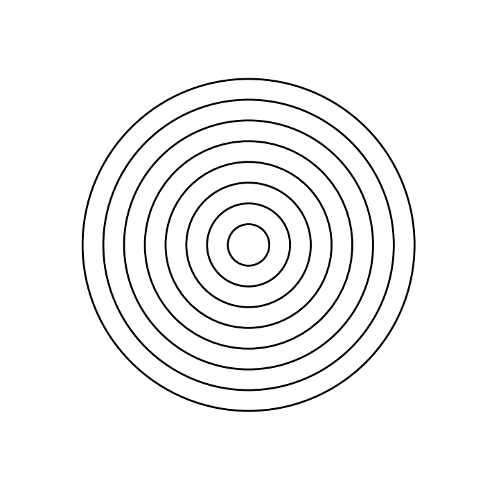

# 计算机图形学作业报告 week

| 年级 | 姓名 | 学院 | 专业 | 学号 |
| ---- | ---- | ---- | ---- | ---- |
|   大五   | 王昊 | 数学科学学院 | 信息与计算科学 | 3220103613 |


## 算法描述与核心代码讲解


## 实验结果

配置环境:
> pip install -r requirements.txt

运行程序:
> ./run.bat

实验结果如下：(可插入图片)



## 参考
1. https://chatgpt.com/

## 源文件
> 在这里粘贴上所有源代码

**concentric_circles.py**

```python
"""使用 Matplotlib 绘制同心圆。"""

from pathlib import Path
import sys

import matplotlib

matplotlib.use("Agg")

import matplotlib.pyplot as plt
from matplotlib.patches import Circle


FIGURE_SIZE = 7
FIGURE_DPI = 100
WEEK2_IMAGE_DIRECTORY = Path(__file__).resolve().parent.parent / "docs" / "images"

from image_utils import save_figure


def draw_concentric_circles(
    count: int = 8,
    spacing: float = 30,
) -> Path:
    """绘制并保存一组圆心相同、半径等间距的圆。"""
    if count <= 0:
        raise ValueError("count 必须大于 0")
    if spacing <= 0:
        raise ValueError("spacing 必须大于 0")

    figure, axes = plt.subplots(
        figsize=(FIGURE_SIZE, FIGURE_SIZE),
        dpi=FIGURE_DPI,
    )
    figure.canvas.manager.set_window_title("Concentric Circles")

    for index in range(1, count + 1):
        radius = index * spacing
        axes.add_patch(
            Circle(
                (0, 0),
                radius,
                fill=False,
                linewidth=2,
            )
        )

    outer_radius = count * spacing
    limit = outer_radius + spacing
    axes.set_xlim(-limit, limit)
    axes.set_ylim(-limit, limit)
    axes.set_aspect("equal", adjustable="box")
    axes.axis("off")

    saved_path = save_figure(
        figure,
        "concentric_circles.png",
        output_directory=WEEK2_IMAGE_DIRECTORY,
    )
    print(f"Saved image: {saved_path}")

    plt.close(figure)

    return saved_path


if __name__ == "__main__":
    draw_concentric_circles()
```

**image_utils.py**复用了week1的文件。